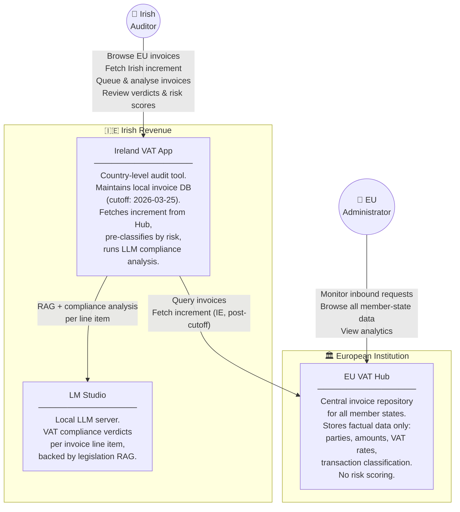
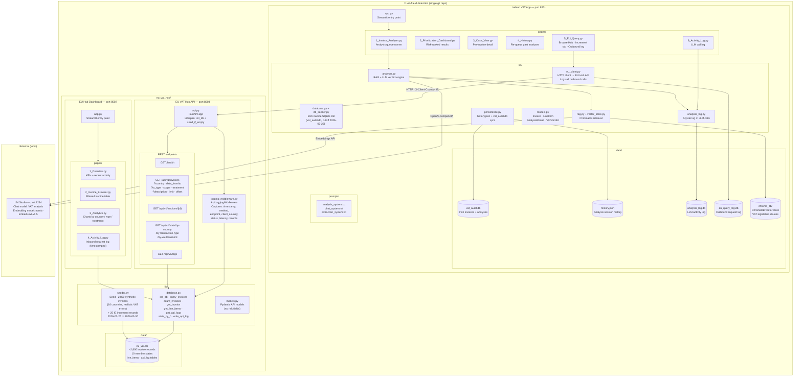
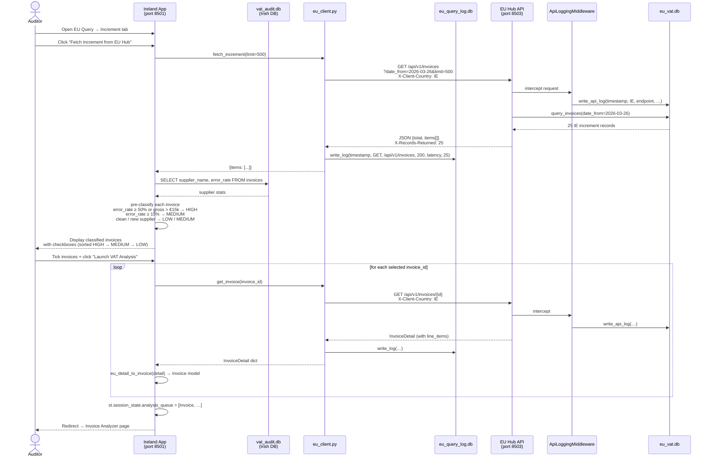
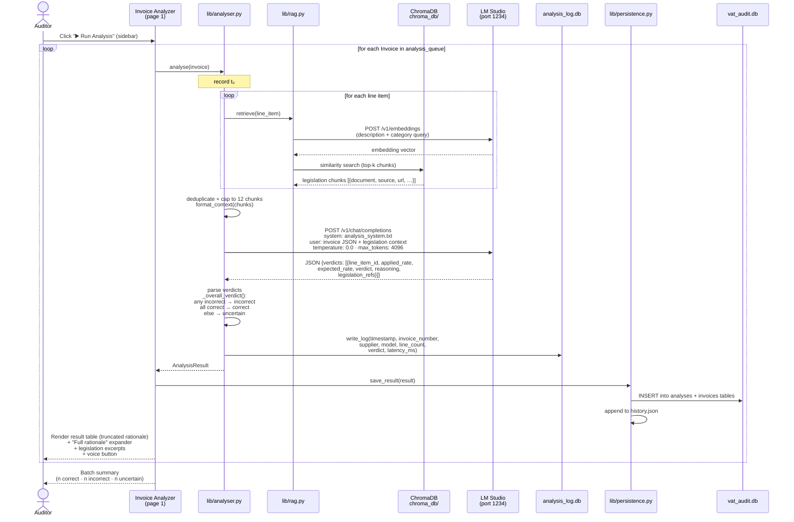
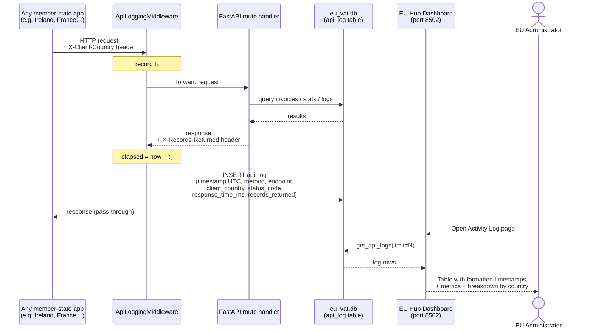

# System Architecture

## 1. Functional Architecture

High-level view of actors, systems, and their responsibilities.

---

## 2. Technical Architecture

Detailed view of all components, scripts, databases and their interconnections.

---

## 3. Data & Request Flows

### 3a. Increment fetch and analysis queue

### 3b. LLM compliance analysis

### 3c. EU Hub inbound logging (all requests)

